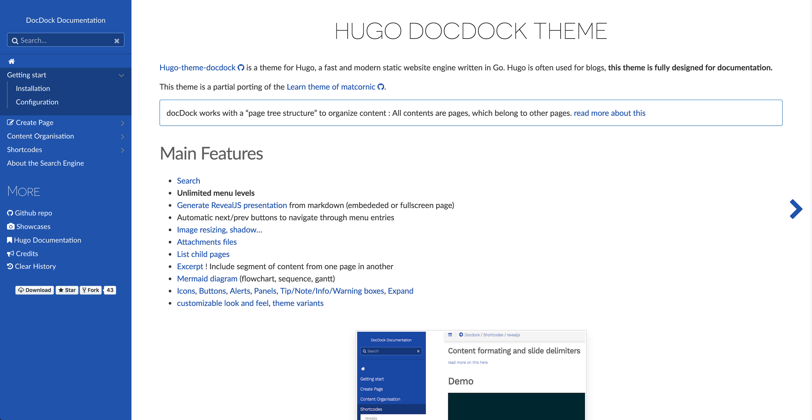
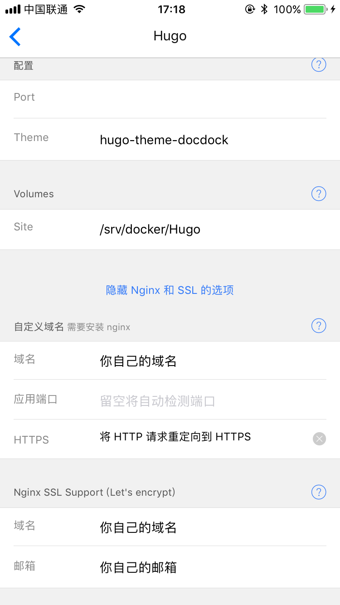

# 使用Hugo搭建惊艳个人博客

**大家好,我是VINGA :)今天为大家介绍Hugo这个静态页面生成引擎并且带来一篇简洁可行的搭建博客的教程.本博客就是使用Hugo来进行搭建的,并且托管在自己的私人VPS上.**
* **本文原文链接https://vinga.tech/hugo**

## 文章更新记录:

* 2017.7.27:增加了rsync作为文件上传的方法.

## 前言介绍

* **Hugo是什么?**

  > **Hugo是一种通用的网站框架。严格来说，Hugo应该被称作静态页面生成引擎。**

* **静态页面生成引擎又是什么?**

  > **静态页面生成引擎从字面上来理解，就是将你的内容生成静态网站。所谓“静态”的含义其实反映在网站页面的生成的时间。一般的web服务器（WordPress, Ghost, Drupal等等）在收到页面请求时，需要调用数据库生成页面（也就是HTML代码），再返回给用户请求。而静态网站则不需要在收到请求后生成页面，而是在整个网站建立起之前就将所有的页面全部生成完成，页面一经生成便称为静态文件，访问时直接返回现成的静态页面，不需要数据库的参与。**

* **那么我采用Hugo来搭建博客优点有哪些?**

  1. **访问快速.因为不需要每次访问生成页面当然，一旦网站有任何更改，静态网站生成器需要重新生成所有的与更改相关的页面。然后由于Hugo是用Go语言编写的在生成速度这方面做的非常好.5000篇文章的博客生成时间只需要6秒钟.对比其他的静态页面生成引擎动不动几分钟的时间优势非常明显**
  2. **采用静态页面搭建博客,维护起来非常简单.事实上根本不需要什么维护，完全不用考虑复杂的运行时间，依赖和数据库的问题。再有也不用担心安全性的问题，没有数据库，网站注入什么的也无从下手**
  3. **无依赖.低消耗资源.实际测试.运行在我VPS上的这个博客.仅占用了10MB的内存.**
  4. **专注于写作.我认为对于个人博客来说，应该将时间花在内容上而不是各种折腾网站。Hugo会将Markdown格式的内容和设置好模版一起，生成漂亮干净的页面。你只需要把Markdown文件放在content文件夹下面.一切水到渠成**

* **听起来很棒的样子那搭建起来会不会非常复杂?**

     **不会.跟着教程走下来.只需要十分钟.**

## 准备

* **运行了最新tf测试板Hyperapp的ios设备一台**
* **一台运行了hugo电脑(本教程以mac来举例子,其他平台自行搜索相关安装教程)**
* **一个域名(见之前域名申请教程)**

## 本地搭建

1. **首先先不要着急去hyperapp安装hugo.因为这样是运行不起来会报错的.我们先在本地搭建一个hugo页面.满意了我们再放到VPS上面去.**
2. **使用命令`brew install hugo`安装Hugo**
3. **使用命令`hugo new site Mysite`新建一个叫做Mysite的网站.这时候在当前目录已经能看见当前目录出现了一个叫做Mysite的目录.里面有一些Hugo的文件**

4. **先去网上寻找一个你满意的主题.为什么要这么做呢.因为hugo默认并没有主题.没有主题的话hugo是不能生生成页面的. https://themes.gohugo.io/ 这是hugo官方的主题仓库的链接.找到喜欢的就进去选择download.会跳转到一个Github的界面.一般来说在readme里面都会有提示怎么安装的.本教程采用docdock主题来举例.链接为 https://github.com/vjeantet/hugo-theme-docdock**
5. **执行命令`cd themes`进入主题文件夹**
6. **执行命令`git clone  https://github.com/vjeantet/hugo-theme-docdock.git docdock`来下载docdock主题.**
7. **我们进去docdock目录看一看都有什么东西.图中就是主题的构成.我们要做的是进入exampleSite文件夹.把里面的所有文件复制的最早的Mysite文件夹里面.注意要选替换选项**

8. **有个事情要注意一下.我们要把themes目录里面的docdock改一下名字.改成`hugo-theme-docdock`并且把config.toml里面`themesdir = "../.."`删掉(此处神坑)**
9. **接下来我们就可以启动hugo来一看究竟了.使用`cd ..`命令可以返回上级目录.一直返回到Mysite目录并且执行`hugo server `启动本地hugo服务器.**
10. **看到提示.这时候hugo server已经启动并且地址是`localhost:1313`.我们去访问看看.一个漂亮的页面就这样展现在我们面前**

## 安装Hugo服务端

1. **请先确认你已经采用正确的设置安装了Nginx Proxy和Nginx SSL Support这两个应用**
2. **打开hyperapp.切换到商店选项卡.找到Hugo这个应用并且选择创建应用.按照图片中的选项来填写**

3. **保存安装.这时候会显示安装成功.但是会显示restart xxxx.这是因为我们还没有把相关的文件上传到服务器.**

## 上传文件

1. **rsync方法:本地执行命令`rsync -av --delete -e 'ssh -p 你的ssh端口默认22' ~/desktop/放到桌面的Mysite文件夹名字/ VPS用户名@VPS地址:/srv/docker/Hugo/`**
2. **压缩方法:使用命令`scp -P 你的ssh端口 你的Mysite.zip的路径 你的登录用户名@你的服务器地址:/srv/docker`来把Mysite上传到服务器的`/srv/docker`目录下面.执行使用`unzip Mysite.zip && mv Mysite Hugo`命令**
3. **回到hyperapp.对Hugo执行更新配置操作**

## 大功告成

* **现在访问你的域名吧!**
* **我的博客所在VPS用的一个提供廉价CN2线路的IDC，有需要的话可以联系我索要推荐链接.双方都有收益.**

## 注意事项

* **如果要添加文章.有两种方法.第一个是使用`hugo new example.md`.另外一个是直接把md文件放到content目录下面.然后参照已经存在的md文件修改顶部的显示设置.这部分请自行摸索.使用hugo new命令创建新文章的话.默认是content目录.要放到content目录下面的example目录的话执行`hugo new example/example.md`**
* **要修改主题的话.请自行阅读主题github的readme网站.**
* **不只是官方主题仓库才有hugo仓库下载.请自行查找.安装方法基本类似**

