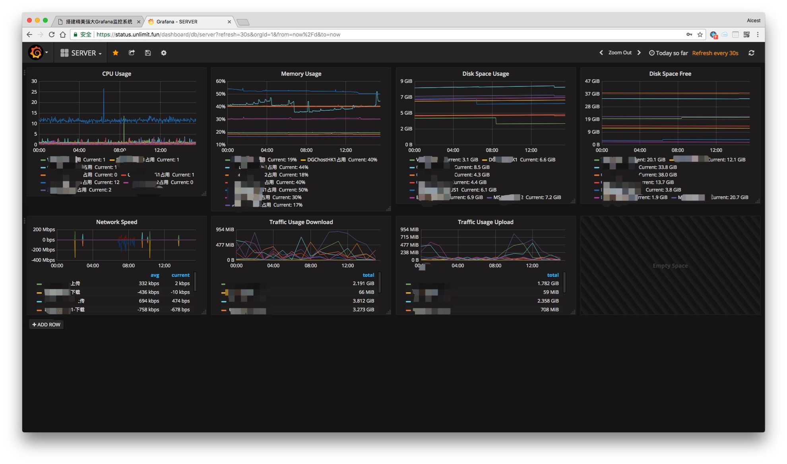

## 搭建精美强大Grafana监控系统


> **随着剁手越来越畅快.手里积攒的小鸡也越来越多了.那今天就讲解一下怎么样搭建一个美轮美奂的基于Grafana+influxDb+Colletcd的监控系统.感谢开源世界!**


## 本文原文链接https://vinga.tech/monitor


## 更新记录

- **2017.10.1:增加了网络拓扑部分.**


## 效果截图





## 网络拓扑


## 准备

* **Hyperapp**
* **一个已经解析正确的域名（ping验证）**
* **耐心.仔细.认真**


## 监控端部署

### 首先我们先进入要提供监控面板的VPS的SSH窗口执行命令


```
sudo su
cd /root/ 
wget --no-check-certificate https://github.com/fanvinga/monitor/raw/master/monitor.zip
unzip monitor.zip 
chmod -R 777 monitor 
rm monitor.zip
```
* **执行完这个命令.在`/root`下会出现一个叫做`monitor`的文件夹.并且里面有三个子文件夹.分别是`grafana` `influxDB` 和`collectd`.里面有一些我们后面会用到的文件.并且我们也会把数据放在这个文件夹里面**


### 其次部署安装influxDB

1. **转到商店页面.找到Docker Image然后选择服务器并且保存进入配置界面**
2. **请完全按照下图配置进行填写！**
3. **保存并且进行安装.**

|    应用设置名称     |                    内容                    |
| :-----------: | :--------------------------------------: |
|     Image     |             influxdb:alpine              |
|    Options    | -p 8086:8086 -p 25826:25826/udp -v /root/monitor/influxdb/conf/influxdb.conf:/etc/influxdb/influxdb.conf:ro -v /root/monitor/influxdb/db:/var/lib/influxdb -v /root/monitor/collectd/types.db:/usr/share/collectd/types.db |
|    Command    |   -config /etc/influxdb/influxdb.conf    |
|     Args      |                                          |
| **Nginx设置名称** |     **influxdb不需要nginx分流.请留空并隐藏设置**      |


### 部署collectd并且把数据传给influxdb

*  **这里我只讲`Debian 8`的安装办法.`Debian 9`直接`apt-get install collectd`即可.除此之外请自行Google搜索`collectd`安装办法**
*  **执行以下命令增加`collectd`的源和`gpg`公钥**
   `echo -e "deb http://pkg.ci.collectd.org/deb jessie collectd-5.7 \n" >> /etc/apt/sources.list.d/pkg.ci.collectd.org.list`
*  **执行以下命令更新源并安装`collectd`**

```
   apt-get update
   gpg —recv-keys 3994D24FB8543576
   gpg —export -a 3994D24FB8543576 | apt-key add -
   apt-get install collectd -y --force-yes
```

*  **自行修改`/etc/collectd/collectd.conf`里面collectd的相应设置.`ping`这个模块里面的目标地址要自行添加到`/etc/hosts`里面.修改完成之后执行`systemctl restart collectd`重启collectd.这里我提供一份优化过的配置.**

```
   Hostname "collectd节点的名字"
   FQDNLookup true
   BaseDir "/var/lib/collectd"
   PluginDir "/usr/lib/collectd"
   TypesDB "/usr/share/collectd/types.db" 
   Interval 30
   LoadPlugin cpu
   LoadPlugin df
   LoadPlugin disk
   LoadPlugin interface
   LoadPlugin memory
   LoadPlugin network
   LoadPlugin ping
   LoadPlugin swap
   <Plugin cpu>
   	ReportByCpu true
   	ReportByState true
   	ValuesPercentage true
   </Plugin>
   <Plugin df>
   	FSType rootfs
   	FSType sysfs
   	FSType proc
   	FSType devtmpfs
   	FSType devpts
   	FSType tmpfs
   	FSType fusectl
   	FSType cgroup
   	IgnoreSelected true
   	ValuesAbsolute true
   	ValuesPercentage false
   </Plugin>
   <Plugin memory>
   	ValuesAbsolute false
   	ValuesPercentage true
   </Plugin>
   <Plugin network>
   	Server "influxdb所在VPS的ip地址/域名" "25826"
   </Plugin>
   <Plugin ping>
   	Host "ZS.Telecom"
   	Host "ZS.Unicom"
   	Interval 5.0
   	Timeout 0.9
   	TTL 255
   </Plugin>
   <Include "/etc/collectd/collectd.conf.d">
   	Filter "*.conf"
   </Include>
```


### 接着找到influxdb的container id并且部署grafana

1. **先在vps的ssh执行`docker ps | grep alpine`.这时候会返回一行`influxdb`的有关信息.这时候我们把最后一小段(形如docker-04f39d)复制出来备用**
2. **转到hyperapp的商店页面.找到Docker Image然后选择服务器并且保存进入配置界面**
3. **请完全按照下图配置进行填写！**
4. **保存并安装,这时候两个docker如果正常启动并且没有报错.访问域名就会正常出现grafana的登录界面**.

|    应用设置名称     |                    内容                    |
| :-----------: | :--------------------------------------: |
|     Image     |             grafana/grafana              |
|    Options    | --link docker-04f39d(请自行修改为你的influxdb的id):influxdb -v /root/monitor/grafana:/var/lib/grafana |
|    Command    |                                          |
|     Args      |                                          |
| **Nginx设置名称** |                  **内容**                  |
|      域名       |              你要给grafana的域名               |
|     应用端口      |                   3000                   |
|     Https     |              将http重定向到https              |
|      域名       |           你要给grafana的域名（自动填写）            |
|      邮箱       |                 域名所对应的邮箱                 |

*  **如果在grafana运行过程中遇到localhost的问题.那么请在初始登录完grafana之后在options里面加上`-e "GF_SERVER_ROOT_URL=你要给grafana的域名"`并且更新配置.**


### 设置Grafana

1. **如图登录`grafana`**
  * **用户名 admin**
  * **密码 admin**

  
2. **点击`Add data source`来到增加数据库界面.按照下图填写配置.要完全一致!**
   
3. **点击`Dashboards`然后选择`New`.选择一个图表样式.这里用`Graph`举例.再点击一下`Panel Title`.会出来一个小菜单.选择`Edit`.按照下图进行配置并且在`Legend`选项卡开启`Avg`即可得到一个节点到联通的链路信息图例.**
   
4. **这只是其中一个小例子.还有监控CPU/内存/硬盘/流量/IO等等的图例.请到Grafana官网查找图例配置教程(官网真的文档非常非常非常齐全).或者Google搜索**


<a href="https://vinga.tech"></a>
